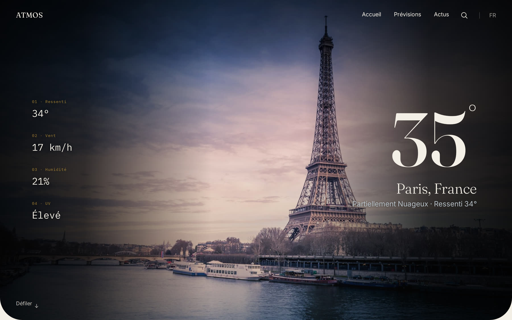
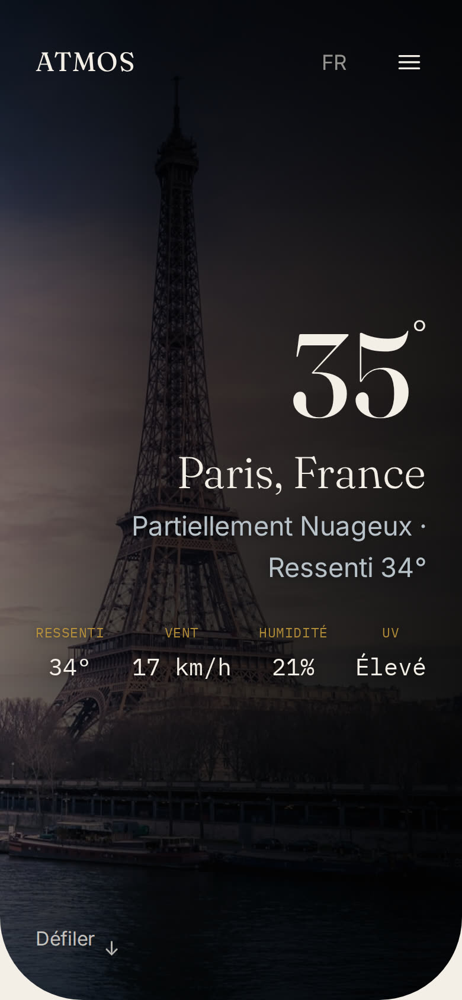
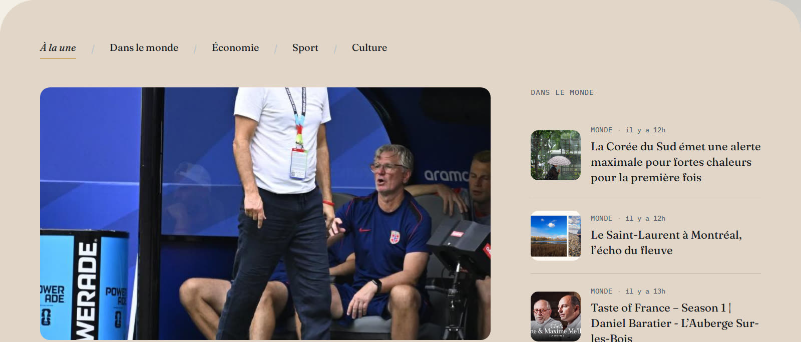
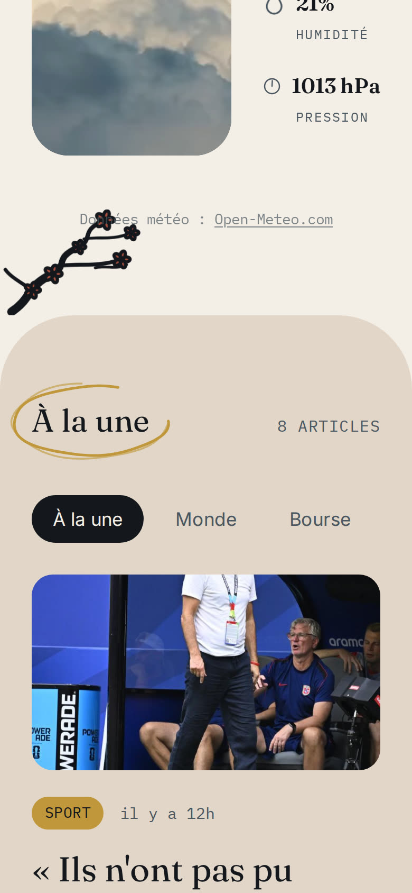

# Atmos

*Un site météo éditorial et atmosphérique.*

Photographie et typographie au premier plan plutôt qu'un dashboard technique classique : une photo full-bleed de la ville sélectionnée, un overlay qui change de teinte selon l'heure locale réelle et la météo du moment, la température affichée en grand directement sur l'image. Projet de portfolio réalisé dans le cadre d'une candidature en alternance.

**[atmos-anouarkh-navy.vercel.app](https://atmos-anouarkh-navy.vercel.app)**


## Aperçu

| Desktop | Mobile |
|---|---|
|  |  |
|  |  |

## Fonctionnalités

- **Overlay atmosphérique dynamique** — hue et opacité du dégradé changent selon 4 tranches horaires (aube / jour / crépuscule / nuit) calculées sur l'heure locale réelle de la ville, croisées avec 6 familles météo (dégagé, nuages, pluie, orage, neige, brouillard). Crossfade GSAP au changement de ville.
- **Recherche de ville en direct** — overlay plein écran (desktop) et menu dédié (mobile), résultats avec température en temps réel, villes récentes conservées en local.
- **Prévisions 7 jours**, données détaillées (UV, vent, humidité, pression) avec un recueil vidéo jour/nuit selon l'heure de la ville.
- **Actualités réelles** — flux France + Monde + Économie + Sport + Culture (NewsData.io), nav de catégories avec animation de survol lettre par lettre, ticker de marchés en mouvement (Twelve Data). Mise en page dédiée mobile (onglets) et desktop (colonnes).
- **Accessibilité vérifiée par le calcul**, pas à l'œil — chaque contraste texte/fond introduit est validé par la formule WCAG (luminance relative), `prefers-reduced-motion` respecté sur toutes les animations, navigation clavier avec focus visible.
- **19 villes curées** avec photographie réelle (pas de dépendance à une API d'images tierce).

## Stack technique

- **Frontend** — React 19, Vite, Tailwind CSS v4
- **Backend** — Node.js, Express (proxy léger entre le frontend et les APIs externes, aucune clé API exposée côté client)
- **Météo** — [Open-Meteo](https://open-meteo.com) — gratuit jusqu'à 10 000 appels/jour, aucune clé ni carte bancaire requise
- **Actualités** — [NewsData.io](https://newsdata.io)
- **Marchés financiers** — [Twelve Data](https://twelvedata.com)
- **Animation** — GSAP (overlay dynamique, scroll-reveal scrubbed), Lenis (smooth scroll)
- **Data fetching** — React Query
- **Déploiement** — Vercel

## Installation locale

**Backend** (terminal 1) :

```bash
cd server
npm install
npm run dev
```

Écoute par défaut sur `http://localhost:3001`. Aucune variable d'environnement n'est obligatoire pour la météo (voir `server/.env.example`) ; les actualités et les marchés nécessitent respectivement `NEWSDATA_API_KEY` et `TWELVEDATA_API_KEY` (gratuites, sans carte bancaire).

**Frontend** (terminal 2, depuis la racine) :

```bash
npm install
npm run dev
```

Ouvre `http://localhost:5173` — le serveur de dev Vite redirige automatiquement `/api/*` vers le backend.

## Démarche

Le développement (architecture, système de design, revue visuelle, accessibilité) s'est appuyé sur Claude Code comme partenaire de conception et de QA — chaque décision vérifiée en conditions réelles (capture d'écran, calcul de contraste, mesure d'animation) plutôt qu'assumée. Le détail des itérations est conservé dans `CLAUDE.md`, pour qui veut approfondir.

## Données

- Météo : [Open-Meteo.com](https://open-meteo.com), sous licence [CC BY 4.0](https://creativecommons.org/licenses/by/4.0/)
- Actualités : [NewsData.io](https://newsdata.io)
- Marchés financiers : [Twelve Data](https://twelvedata.com) (ETFs de référence, les indices purs sont réservés aux plans payants)

## Licence

MIT — voir le fichier [LICENSE](./LICENSE).

## Crédits photo

- Paris — photo par Chris Karidis, via [Unsplash](https://unsplash.com)
- Lyon — photo par Adrien Olichon, via [Unsplash](https://unsplash.com)
